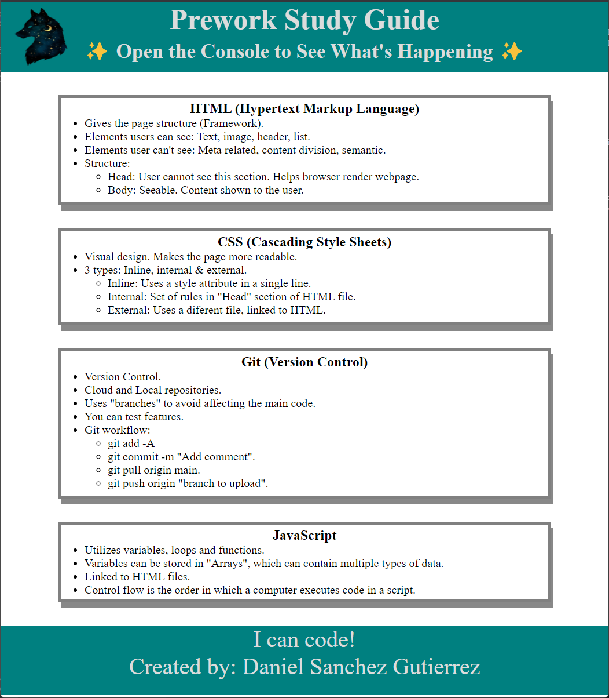

# Prework Study Guide Webpage

## Description

This prework study guide was created as a simple way to refer back to the most important elements reviewed during the pre-work section of the bootcamp. It allows the user to view in a single page the notes taking regarding the main topics of HTML, CSS, Git and JavaScript.

## Installation

N/A

## Usage

The webpage is divided into sections, each one hosting a different topic. Inside each section, you can read and review notes taken during the prework.

For suggestions on which topic to study first, open the Chrome DevTools by pressing Command+Option+I (macOS) or Control+Shift+I (Windows). A console panel should open either below or to the side of the webpage in the browser. There you will see a list of topics we learned from the prework along with a suggestion on which topic to study first.

### The webpage

## Credits

N/A

## License

Please refer to the LICENSE in the repo